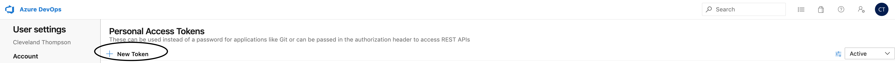
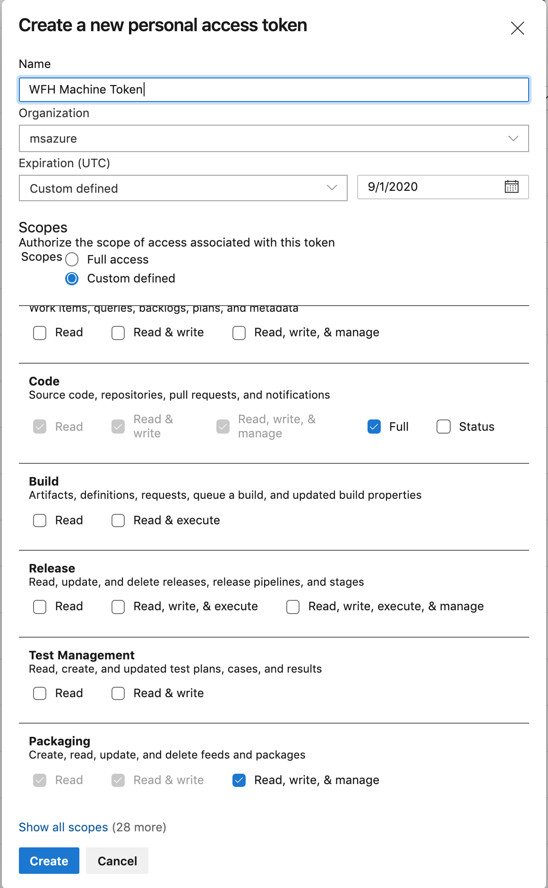
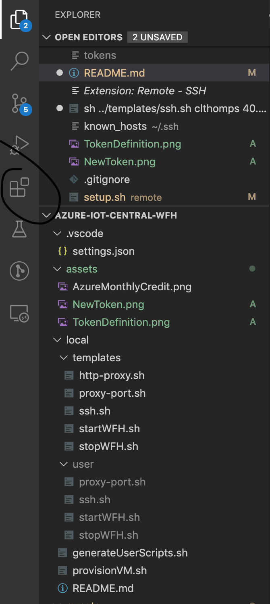
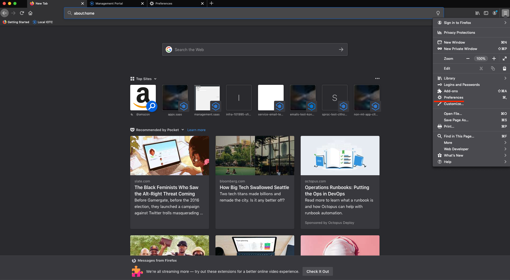
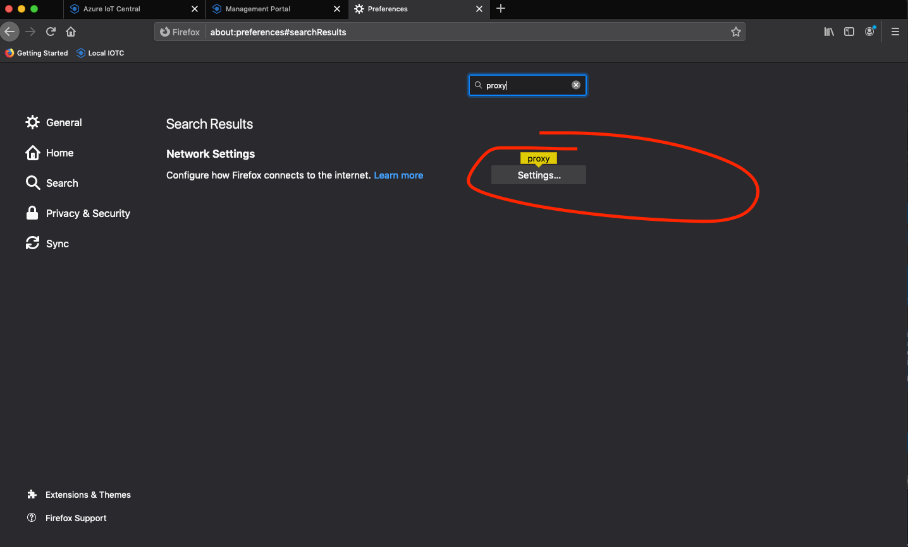
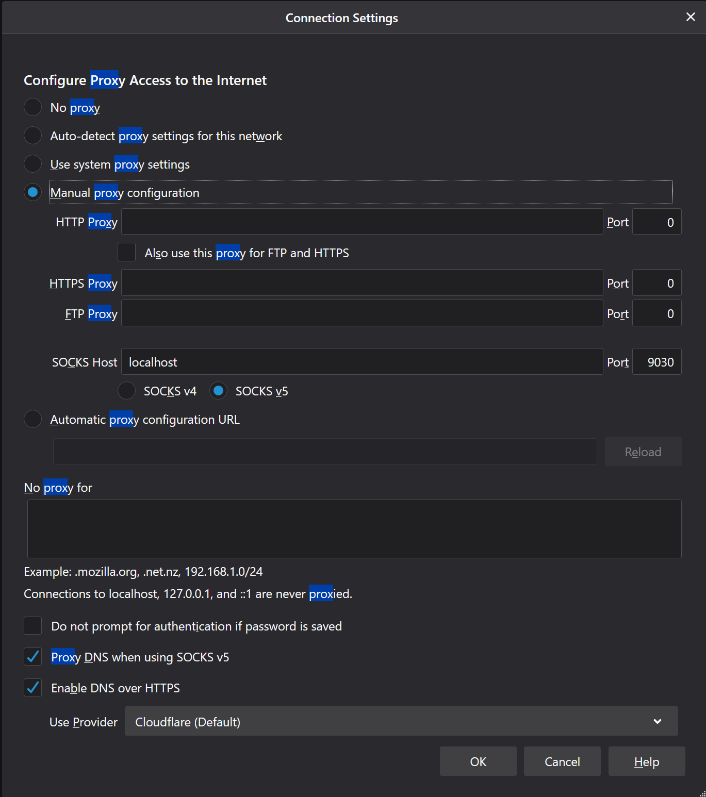

# Working Remotely with Azure IoT Central

With the current global health crisis, the way we approach our daily tasks--including work--is changing. I've put together this documentation of how I've managed the transition to remote work in hope that other members of our team can benefit.

If you're an intern reading this: Welcome! We are incredibly excited to have you on board, and, on behalf of the entire IoT Solutions Team, thank you for working with us as we figure out the best way to support you guys from afar.

## Goal

Laptops often aren't powerful enough to run our local environment in a developer-friendly way. If you don't have a desktop machine to RDP to (or, as in my case, don't enjoy coding through RDP), this solution allows you to leverage the computing power of an Azure VM, while still enjoying a native development experience.

## Guide

### Prerequisites

1. Powershell. All the commands on your local machine will be run using powershell.
1. [Visual Studio Code](https://code.visualstudio.com/download).
1. For interns/new hires--make sure you have your access configured, your github account linked appropriately, DockerHub account created, etc. before going through this guide. Work with your manager/mentor to get this all set up correctly.

### Set up Visual Studio Enterprise subscription with your MSDN Account

1.  Go to the Visual Studio Enterprise Subscription [Management Page](https://my.visualstudio.com/benefits)
1.  Login with your Microsoft Work Account (if you're an intern and either have not set this up or are getting Permission Denied, ask your manager)
1.  Under "Azure \$150 monthly credit" hit "Activate"

      

1.  Enter the email of your personal MSDN Account (NOT your work email) and follow the steps.

### Create a VM

Next, we are going to provision the guts of our development environment. I have put together a script to do this for you automatically (using Powershell).

1. Install Azure CLI for your operating system by following the instructions [here](https://docs.microsoft.com/en-us/cli/azure/install-azure-cli?view=azure-cli-latest). If you already have Azure CLI, _make sure you upgrade to latest_. For Windows users, make sure you install Azure CLI _for WSL_.
1. From your shell, run `az login`, and follow the prompts to login with your MSDN Account (Not your microsoft account).
1. Clone this repo
1. Open Powershell and navigate to the `local` directory under this project.
1. Run `./provisionVM.ps1`. The location defaults to West US, but feel free to change it to something closer to you (the list of valid location values will be listed for your convenience). This will provision your machine and generate all the scripts you'll need to use on the day-to-day in the `local/user` directory.

### Set up your VM to run IoT Central

Okay, great! We have our machine. Next, let's get IoT Central running.

Before we set up our environment, we need to create a Personal Access Token (PAT) on the Azure Dev Ops [PAT page](https://msazure.visualstudio.com/_usersSettings/tokens). Make sure you are logged in as your Microsoft account.

1. Click "New Token."

 

1. Name it something like "WFH Machine Token" (just as long as you know what it is).
1. Leave the Organization field alone.
1. If you are an intern, change the Expiration Date to the day AFTER your internship ends.
1. Select "Custom Defined" under scopes.
1. Give the token the following
    1. Code -- Full
    1. Packaging -- Read, Write, and Manage
1. It should look something like this

 

1. Click "Create."
1. Copy the resulting string, but make sure you protect it like you would your password. It gives the owner access over your account :). Paste it somewhere TEMPORARY, because it will go away, and you won't be able to get it back.

Now that we have our token, let's set up our new machine.

1. Navigate to the local/user folder.
1. Run `./startWFH.ps1`

You'll be ssh-ed into your new machine. These next set of instructions will all be on this remote machine.

1. Clone this repo.
1. Navigate to the `remote` directory.
1. run `sh setup.sh`
1. When prompted, enter your alias and the PAT you created earlier.
1. If git prompts you for your "password," that will be your PAT as well.
1. Your machine should be configured!
1. Run `sudo reboot` to finish configuration. This will reboot your remote machine.

This will kill our ssh connection, and we'll now be back on our local machine. Give it a minute, while your machine reboots, and then run `./ssh.ps1` from the `user` folder. If ssh connects successfully, we're good to move on to the next step. If not, your machine probably hasn't finished rebooting--try again!

1. Finally, run `sh run.sh` from the `remote` folder.
1. You'll be prompted to login with docker hub. Do that.
1. You'll be prompted to do a "device login." Just follow the prompt, but make sure you log in with your MICROSOFT ACCOUNT.

This will prompt you to login with docker hub, then will pull all the docker images for our service and run IoT Central on your remote machine. As soon as you see a ton of loading bars for the docker images (there's a lot to download here), go ahead and move on to the next section, and let this run in the background.

### Set up remote ssh extension with VSCode

Alright, now our remote machine is almost totally configured, let's get our dev environment set up.

1. Go to the `extensions` tab in VSCode and search "ssh"

 

1. Install "Remote - SSH" extension. You'll probably need to reload vscode.
1. Go to the new "Remote Explorer" tab
1. Click the `+` button.
1. In the prompt enter the following: `ssh <alias>@<ip> -A`. You public ip is populated in some of the files under the `user` folder if you don't have it from earlier.
1. Hit Enter.

You should now see your ip pop up under "SSH TARGETS" in the left nav. Right click on it, and select "Connect to Host in New Window."

This will open a VSCode instance that points at your remote machine. wOw.

1. Click "Open Folder" and open "azure-iots-saas" (the IoT Central git repo).

### Set up Firefox port proxy

Great, so we have our remote machine set up, and it should be running IoT Central locally. Next, let's see our instance of the app. For this portion of the tutorial, we are going to use Firefox, which I use exclusively for this purpose. In theory, it works with other browsers, too.

1. If you don't have it already, [install Firefox](https://www.mozilla.org/en-US/exp/firefox/).
1. Go to preferences (options on Windows) (Hamburger menu > Preferences (options)).

 

1. Search "proxy" and click the resulting "Settings."

 

1. Make your settings look like this:

 

Cool, that's all we need to do for firefox. Make sure the download script that's running on your remote machine is complete (and didn't fail) before continuing.

### Proxy port over ssh

Here's where the magic happens.

1. Go to the `user` directory and run `sh proxy-port.sh`.
1. Go to Firefox and navigate to [https://apps.saas.localhost/]().
1. You should see IoT Central running there :).
