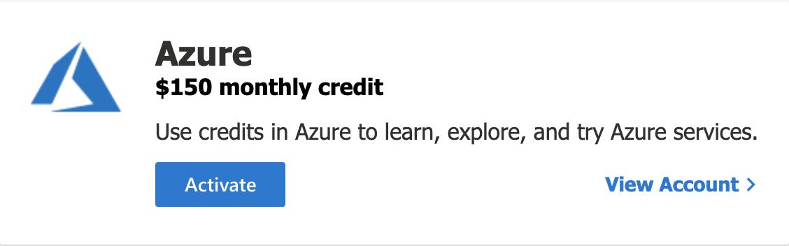

# Working Remotely with Azure IoT Central

With the current global health crisis, the way we approach our daily tasks--including work--is changing. I've put together this documentation of how I've managed the transition to remote work in hope that other members of our team can benefit.

If you're an intern reading this: Welcome! We are incredibly excited to have you on board, and, on behalf of the entire IoT Solutions Team, thank you for working with us as we figure out the best way to support you guys from afar.

## Goal

Laptops often aren't powerful enough to run our local environment in a developer-friendly way. If you don't have a desktop machine to RDP to (or, as in my case, don't enjoy coding through RDP), this solution allows you to leverage the computing power of an Azure VM, while still enjoying a native development experience.

## Guide

### Set up Visual Studio Enterprise subscription with your MSDN Account

1. Go to the Visual Studio Enterprise Subscription [Management Page](https://my.visualstudio.com/benefits)
1. Login with your Microsoft Work Account (if you're an intern and either have not set this up or are getting Permission Denied, ask your manager)
1. Under "Azure \$150 monthly credit" hit "Activate"
   
